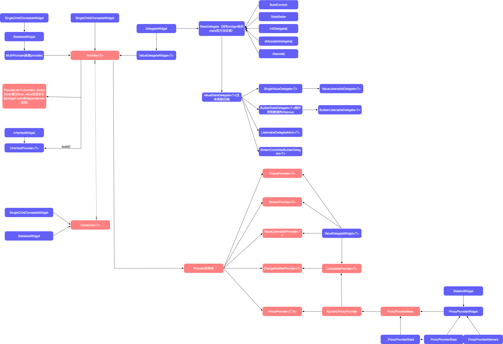

# Flutter 状态管理

* MVC + setState
* InheritedWidget
* ScopedModel
* Provider
* Bloc/RxDart
* MobX
* Redux

## flutter状态管理的常见方式

目标：

* 逻辑与视图解耦
* 数据同步

###mvc + setState

最简单的使用方式，在业务很简单的情况下，这种方式最简单最高效，使用单独的数据类作为`model`层，抽离业务逻辑作为`controller`层，`widget`树作为`view`层，在数据改变或者状态改变时，直接调用`setState()`方法来更新UI，所见即所得。

**优点：**

* 简单场景下特别适用，逻辑简单，易懂易实现
* 所见即所得，效率比较高

**缺点：**

* 逻辑与视图耦合严重，复杂逻辑下可维护性很差
* 数据传输基于依赖传递，层级较深情况下不易维护，可读性差

### InheritedWidget

`InheritedWidget`是flutter widget `framework`中的类，是SDK内嵌的数据传输方式，数据可以通过`InheritedWidget`很方便的从`widget`树根节点传递到子`widget`树，数据更改时自动更新布局，包括`ScopedModel`和`Provider`等很多第三方的状态管理方案，都是基于`InheritedWidget`实现的。

**工作原理：**

* `InheritedWidget`继承自`ProxyWidget`，子类继承`InheritedWidget`后作为一个普通的`widget`插入到`widget`树种使用，并覆盖`updateShouldNotify`决定依赖此`InheritedWidget`的子`widget`是否需要rebuild
* `BuildContext`提供`inheritFromWidgetOfExactType()`方法，`Element`继承了`BuildContext`，并且实现了`inheritFromWidgetOfExactType()`方法，可以根据`InheritedWidget`子类名称遍历其父节点，找到第一个出现的对应`type`节点并获取其引用，进而调用其暴露的方法。
* 调用过`inheritFromWidgetOfExactType()`方法的`widget`会添加到对应`InheritedWidget`的依赖列表中，当`InheritedWidget`数据更新时会自动调用`widget`的`didChangeDependencies(StatefullWidget独有)`和`rebuild`流程。
* 若只想获取`InheritedWidget`调用其方法，但是不希望`InheritedWidget`数据变化引起`rebuild`，可以使用`ancestorInheritedElementForWidgetOfExactType()`

**优点：**

* 方便数据传输，可以基于`InheritedWidget`达到逻辑和视图解耦的效果
* flutter内嵌类，基础且稳定，无代码侵入

**缺点：**

* 属于比较基础的类，友好型不如封装的第三方库
* 对于性能需要额外注意，刷新范围如果过大会影响性能
* 不支持异步状态管理

### ScopedModel

**author：**Andrew Wilson,  Brian Egan

**GitHub：**https://github.com/brianegan/scoped_model

基于`InheritedWidget`和`Listenable`实现的数据从`widget`树根部向子`widget`树传递的封装，并自动更新布局显示，比单独的`InheritedWidget`更简单易用，最初是由`fuchsia`代码库提取出来的，非常简单，加上一堆注释也才不到300行。

**核心类：**

* `model`，继承自`Listenable`，复写了`notifyListeners`核心方法
* `ScopedModel`，继承自`StatelessWidget`，在`build`方法里面巧妙的用了`AnimatedBuilder`，将`model`作为其`animation`参数，只要调用了`model`的`notifyListeners`参数，就会调用`AnimatedBuilder`的`build`方法，从而更新`_InheritedModel`
* `_InheritedModel`，继承自`InheritedWidget`，复写了其`updateShouldNotify`方法，当`model`的`version`不一致时，会通知所有依赖它的`widget`更新
* `ScopedModelDescendant`，继承自`StatelessWidget`，并且内嵌了`inheritFromWidgetOfExactType()`方法查找其依赖的`model`，方便使用

**优点：**

* 简单易懂，上手快
* 数据逻辑完美融入了widget树中，代码结构清晰
* 针对简单场景下的使用比较方便

**缺点：**

* 仅仅是对`InheritedWidget`做了一层封装，适用的场景有限
* 不支持多model
* 代码侵入
* 不支持异步状态管理

### Provider

**author：**Remi Rousselet, Flutter Team

**GitHub：**https://github.com/rrousselGit/provider

`Provider`是基于`InheritedWidget`实现的，与`ScopedModel`有一定的类似，但是功能和实现上比后者完善很多，不仅包含`ScopedModel`可以实现的所有功能，还支持多`model`，提供多种`provider`类型以适应不同的应用场景，支持异步状态管理，且解决了`Bloc`最关键的资源回收问题。架构图如下：

**工作原理：**

* `DelegateWidget`继承自`StatefulWidget`，内部持有`StateDelegate`，是整个框架中`provider`的基础，是`provider`可以插入`widge`t树并暴露`state`生命周期的核心类
* `Provider`可以提供`Disposer`，`Disposer`是一个`dispose`生命周期的回调方法，这一切的实现依赖于`StateDelegate`，`StateDelegate`代理了`DelegateWidget`中的`context`和生命周期方法，可以提供给上层作为回调调用，代理方法有：

~~~dart
initState() => delegate.initDelegate()
didUpdateWidget() => delegate.didUpdateDelegate()
dispose() => delegate.dispose()
~~~

* `Provider`继承自`ValueDelegateWidget`，通过持有不同实现的`ValueStateDelegate`来适应不同的应用场景，进而配合`Provider`的`build`方法衍生出不同种类的`provider`
* `Provider`数据传递基于`IheritedWidget`，其`build`方法会包含一层`InheritedProvider`， `InheritedProvider`继承自`InheritedWidget`，向外暴露`updateShouldNotify()`方法接口，底层逻辑与单独使用`InheritedWidget`一致
* `Provider`包裹了一层`of()`方法，可以方便的获取对应`provider`的引用，其本质还是调用`context`的`inheritFromWidgetOfExactType()`和`ancestorInheritedElementForWidgetOfExactType()`方法，有一点务必**注意**，若直接使用`Provider.of()`方法，一定要确认当前`context`的作用域，使用这种方法引起的`rebuild`会在当前`context`的作用域内整体`rebuild`，如果不是很有把握，建议直接使用`consumer`
* 当有多个`provider`的时候可以使用`MultiProvider`，其接受一个`provider`列表作为参数，代码结构上比较易读，底层在`build`的时候会循环调用`provider`的`cloneWithChild()`方法，其本质是多`provider`的嵌套结构
* `Consumer`是整个框架中的消费者，接受一个`widget builder`作为参数，其`build`方法中会自动获取对对应的`provider`传递给`builde`，`builder`中即可调用`provider`暴露的方法。**注意**，`consume`r默认是依赖数据并`rebuild`的，如果只是想要调用`provider`的方法，并不想受数据变化的影响，建议直接使用`Provider.of(context, listen: false)`方法获取`provider`引用。

**Provider类型解析：**

上文提及，`Provider`通过持有不同实现的`ValueStateDelegate`来适应不同的应用场景，进而配合`Provider`的`build`方法衍生出不同种类的`provider`，这里讨论`provider`的种类和每种`provider`对应的应用场景。

* **Provider**

  `provider`接受`Value/ValueBuilder`和`disposer`作为参数，可以控制资源销毁，但`value`不能是`Listenable`和`Stream`的子类，其内部数据改变不会调用`setState()`，`InheritedProvider`的数据不会得到更新，数据的改变不会反应在UI上，也就是说，`provider`只能接收固定数据以供子`widget`使用，除非手动调用`setState()`，但是这种情况下建议使用`ValueListenableProvider`或`ChangeNotifierProvider`

* **ListenableProvider**

  `ListenableProvider`接收`Listenable`类的value，其`StateDelegate`混入了`_ListenableDelegateMixin`，在`initDelegate()`时机启动listener监听，外部调用`notifyListeners`时会调用`setState()`方法，进而更新`InheritedProvider`的数据，最后将变动传递给依赖此`provider`的子`widget`，更新逻辑位于`StateDelegate`中，`ValueListenableProvider`的更新逻辑则依赖`build`中嵌套的`ValueListenableBuilder`

* **ChangeNotifierProvider**

  `ChangeNotifierProvider`是`ListenableProvider`的子类，接收`ChangeNotifier`类的value，`ChangeNotifier`是`Listenable`的子类，内部集成了`dispose()`的回调，使用起来会比直接使用`ListenableProvider`方便。

* **ValueListenableProvider**

  `ValueListenableProvider`继承自`ValueDelegateWidget`，接收`ValueNotifier`类的value，与`ListenableProvider`不同的是，它的`InheritedProvider`数据更新逻辑位于build中嵌套的`ValueListenableBuilder`中。`ValueNotifier`继承自`ChangeNotifier`并暴露value的`set`方法，相较于`ChangeNotifierProvider`，前者在设置新数据时直接调用`notifyListeners()`方法

* **ProxyProvider**

  上述`provider`的数据均是来自自身，对外部没有依赖，假如A，B，C三个`provider`嵌套，C依赖于A的数据，这个时候需要用到`ProxyProvider`实现依赖注入，它代理了`state`的`didUpdateDependencies()`方法，并且有一个`builder`函数作为入参，每次依赖的数据变化时，会回调`builder`函数并将返回值作为此`widget`的数据，依赖此`provider`的`widget`获取到的数据是经过依赖注入后的数据

* **StreamProvider**

  `StreamProvider`继承自`ValueDelegateWidget`，接收`Stream/StreamController/StreamBuilder`参数，核心value是`Stream`，其build方法内嵌了一层`StreamBuilder`，当`Stream`输出新数据时`StreamBuilder`会调用`build`方法更新`InheritedProvider`的数据，进而传递给依赖此provider的子`widget`，具有异步状态管理的功能。

* **FutureProvider**

  `FutureProvider`继承自`ValueDelegateWidget`，接收`Future`类的`value`，其build方法内嵌了一层`FutureBuilder`，当`Future`返回数据时`FutureBuilder`会调用`build`方法更新`InheritedProvider`的数据，进而传递给依赖此provider的子`widget`，具有异步状态管理的功能。

**优点：**

* 功能完善，涵盖了ScopedModel和InheritedWidget的所有功能
* 数据逻辑完美融入了widget树中，代码结构清晰，可以管理局部状态和全局状态
* 解决了多model和资源回收的问题
* 对不同场景下使用的provider做了优化和区分
* 支持异步状态管理和provider依赖注入

**缺点：**

* 局部状态之前的数据同步不支持
* 具有一定的代码侵入
* 使用不当可能会造成性能问题

### Bloc

### MobX

### Redux

### 

## 结论&对比

